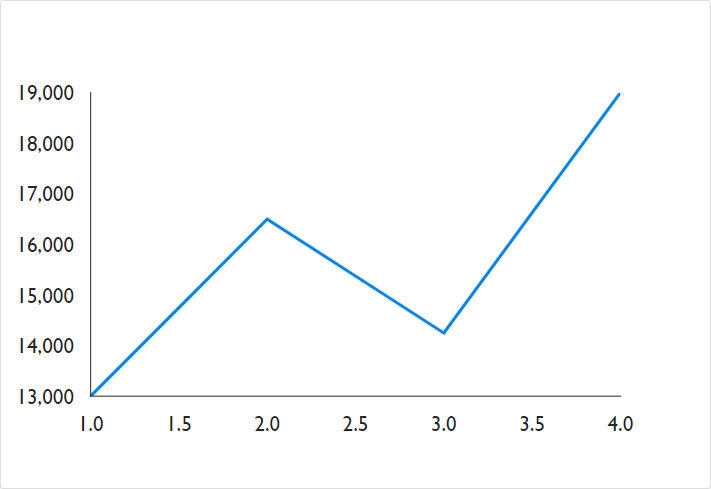
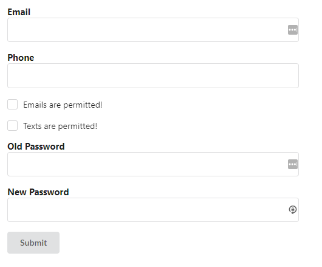
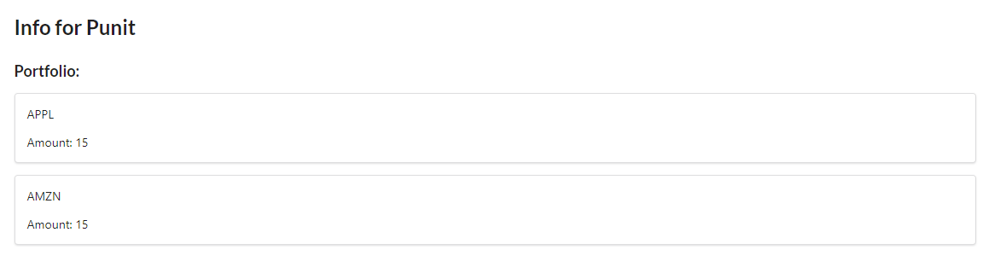

First week of labs...

<!-- end -->

## Accomplishments

This week was a lot of getting used to the environment I would be working in for the next few weeks. I have worked with others before, but it was at a much smaller scale, and things were not as professional and it was more of a casual experience. Working in a semi-Agile environment took a bit of getting used to, referring to Trello, having constant meetings, but I think I have gotten the hang of it and have slowly began enjoying having a more organized workspace. I personally did more work on the Front-End side, working closely with other team mates to create React components that we would be using in the future. Although a lot of the data pulled were either placeholders or mock data, laying out the components, I believe, provided a lot of value in terms of thinking of the users and how they would interact with the app. I also struggled to figure out what was wrong with our Django + AWS deployment as well as our Django + React integration, where the React webpack files automatically feed into the Django template, however, the team decided to focus on getting actual work done rather than struggling more with configuration. All in all, I would say this was a good week in terms of getting started, but in the future weeks I would like to see myself and my team members accomplish a lot more given a week's worth of work.

### Front End
- Landing Page
    - [Github](https://github.com/Lambda-School-Labs/labs9-stock-trainer/pull/2)
    - [Trello](https://trello.com/c/xysMNFxz/20-design-a-front-end-landing-page)
- ESLint Config
    - [Github](https://github.com/Lambda-School-Labs/labs9-stock-trainer/pull/8)
    - [Trello](https://trello.com/c/5nIHTAad/33-set-up-eslint)
- React Components
    - [Github](https://github.com/Lambda-School-Labs/labs9-stock-trainer/pull/10)
    - [Trello](https://trello.com/c/r83Q84C0/34-create-basic-components-in-react)
- README.md Setup
    - [Github](https://github.com/Lambda-School-Labs/labs9-stock-trainer/pull/11)
    - [Trello](https://trello.com/c/ptlDctTH/12-readme)
- UserInfo Page
    - [Github](https://github.com/Lambda-School-Labs/labs9-stock-trainer/pull/15)
    - [Trello](https://trello.com/c/r83Q84C0/34-create-basic-components-in-react)

### Back End
- User Model
    - [Github](https://github.com/Lambda-School-Labs/labs9-stock-trainer/pull/17)
    - [Trello](https://trello.com/c/cYgwwCoB/22-setup-user-accounts)
- Heroku Deployment
    - [Github](https://github.com/Lambda-School-Labs/labs9-stock-trainer/pull/20)
    - [Trello](https://trello.com/c/LPO4yVAd/30-deploy-backend-to-heroku)

### Attempted
- Django link with React
    - [Trello](https://trello.com/c/BSnNCkn3/42-linking-django-react)
- AWS Deploy
    - [Trello](https://trello.com/c/LPO4yVAd/30-deploy-to-aws)

## Detailed Analysis

#### Building out React Components

Working on React is always fun, building out components that can be reusable is super powerful. I made a few components throughout this week and although most of them are not connected to the back-end, I tried my best to envision how the data would look like in order to best mock how the components should look with data from our API. For example, the Grpah and UserInfo components below have mocked data that try to replicate how data would be received from our back-end or third party APIs. I think this is important to do for a seamless transition into integrating the front-end with the back-end, as the components should be ready to handle the rendering and the data can be set via `setState` and `componentDidMount` on the component. Overall, I had fun scoping out React components and I would like to work more on how the data flows between components and how we can do that most efficiently in the future weeks.

## Reflection

Working with a bigger team made me realize that holding meetings would be a very important part of our workflow. Making sure that everyone is on the same page, giving updates to what team members are working on, and figuring out which team members should do which tasks were some of the topics during our meetings. There were many ideas being shared and usually our team could come to agree on a final decision on most ideas being shared. In terms of the friction of the group, I think it was mostly due to everyone not being too familiar with each other and different personality traits of the team members. I personally tried to pair program or get in a 1:1 call with team members that were doing similar work to what I was doing, so that I could get a better understanding of the team member's work style and also to get more comfortable with my team. I tried to stay updated on different statuses within the group (deployment, Django/React link) and tried to help out as much as I could. Unfortunately, we came across a lot of issues with deployment and also making Django render the bundled React files, so that put us a bit behind on schedule, but I'm confident that we'll be able to work through and be where we should be.

- [Front End](https://stock-trainer.netlify.com/)
- [Back End](https://backend-stock-trainer.herokuapp.com/api/)
