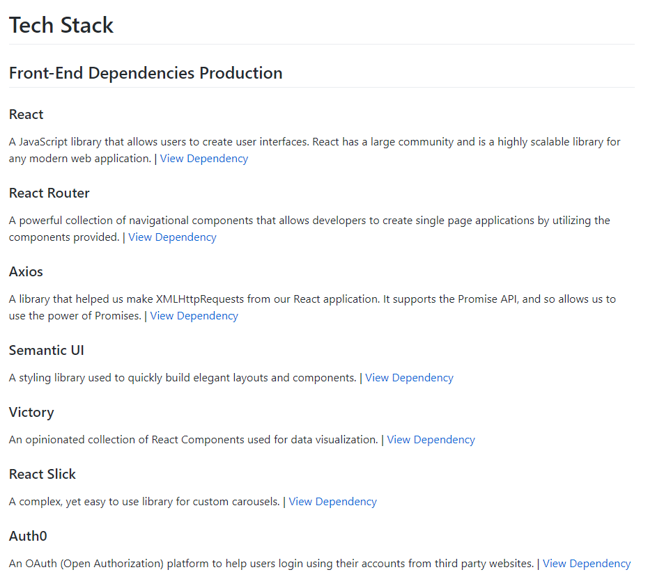

Second week of labs...

<!-- end -->

## Accomplishments

[Whiteboarding](https://www.youtube.com/watch?v=lNTm8XoQ28k&feature=youtu.be)

This week was a bit hectic for me personally, as I had two final round interviews, leading me to miss many hours of contribution. I realized that missing even a day would make me lose track of what the team is currently working on, and it was pretty difficult to jump right back into the flow. After coming back on Tuesday, I jumped in to fix the Heroku deployment, which was really a problem with our Django application. There were many parts that were added, and there were also many errors and typos that were in the master branch. I tried to stress the importance of running the code locally and testing to see if it works before a merge occured. After, I completed the integration of Stripe in the front-end and the back-end, which was integrated by communication by tokens. The next day, I had another final round, so I took it a bit slower, and focused on documentation, which I am proud to say looks pretty nice and succinct. Finally, I was able to get autosuggestions working on our stock searchbar, which allows users to search stocks either by company name or by the stock symbol. I also worked to make the stock component part of our front-end reusable and got my first exposure to how CSS Grid works.

### Front End
- Stock Component
    - [Github](https://github.com/Lambda-School-Labs/labs9-stock-trainer/pull/50)
    - [Trello](https://trello.com/c/XaZblkKc/82-implement-reusable-stock-data-component-for-dashboard-and-top-of-stock-page)
- Stock Search Suggestions
    - [Github](https://github.com/Lambda-School-Labs/labs9-stock-trainer/pull/48)
    - [Trello](https://trello.com/c/PsbvZQoO/78-working-stock-search)

### Back End
- Fix Heroku Deployment
    - [Github](https://github.com/Lambda-School-Labs/labs9-stock-trainer/pull/34)
    - [Trello](https://trello.com/c/yOL98ajn/71-fix-heroku-deployment)

### Misc
- Front-End/Back-End Integration
  - Stripe
    - [Github](https://github.com/Lambda-School-Labs/labs9-stock-trainer/pull/36)
    - [Trello](https://trello.com/c/T6hwMyFg/72-connect-stripe-component-in-front-end-with-back-end)
- Documentation
  - README
    - [Github](https://github.com/Lambda-School-Labs/labs9-stock-trainer/pull/41)
    - [Trello](https://trello.com/c/ptlDctTH/12-readme)

## Detailed Analysis

#### Stock Search Suggestions

Andrew suggested that I should try to work on a searchbar that would automatically suggest stocks for the users depending on what they inputed. He pointed me toward the right direction -- toward react-autosuggest and also NASDAQ. I was able to write a Python script, which allowed me to create a JSON file, which was an array of objects, which would be for use on our search bar. The objects contained the name of the stock and also the symbol of the stock. I was able to get it integrated with one of our test routes, which was a route to test pulling stock data from our backend. Initially, the autosuggest only worked with the name, but I figured out how to also query by symbol and also add a bit of customization and styling to the autosuggest component. When Andrew first suggested I should look into this, I thought it was more of a feature that felt kind of "extra," but after implementing it, I do believe it is crucial to the user experience and also the seamless flow that our application is trying to accomplish.

I don't think there's a lot to be shown via screenshots (one big json file is not impressive), so I will include some of the other work that I finished this week.

## Reflection

I found it pretty difficult to have some people working on different crucial parts of the application, and then have different portions that depending on those crucial parts stuck in limbo due to the part not being complete. I don't think it would be wise to focus all of our direction onto the crucial parts, but sometimes it can be difficult when progress is not being made due to a crutch in functionality. In terms of incorporated APIs into our application, I do think we're at a stage where our APIs are well integrated, and can actually now be customized for extra functionality. In terms of how my pieces of the project integrated with my teammates, I would always try to keep the members working on similar functionality updated on my progress. After finishing a task, I would try to hop in and see if anyone needed help or could use an extra set of eyes as well.

- [Front End](https://stock-trainer.netlify.com/)
- [Back End](https://backend-stock-trainer.herokuapp.com/api/)
