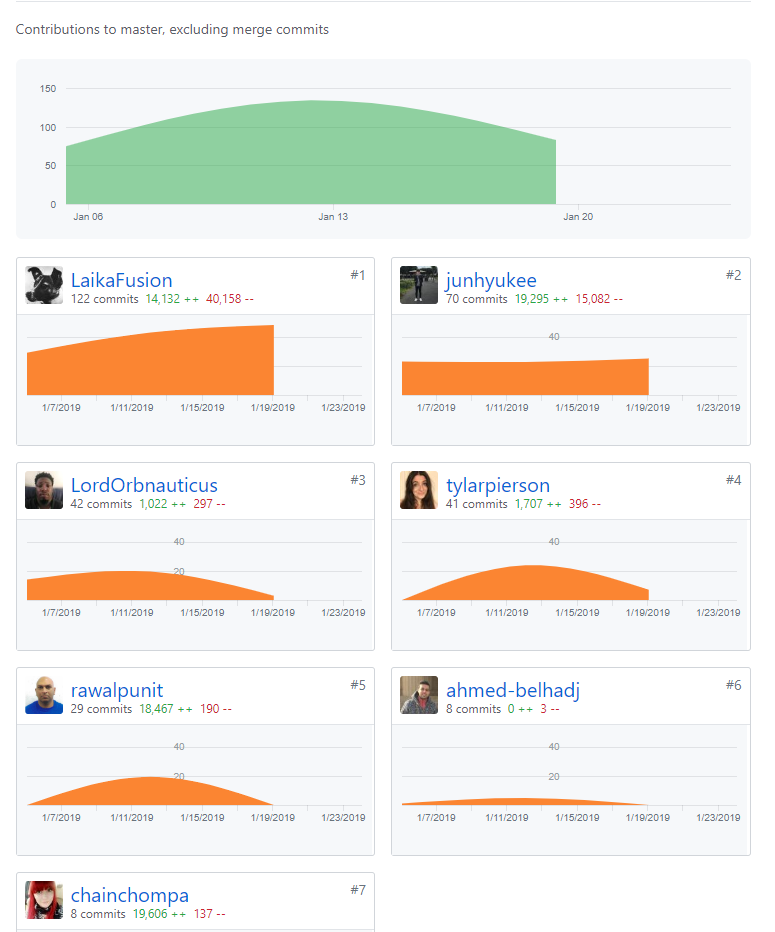
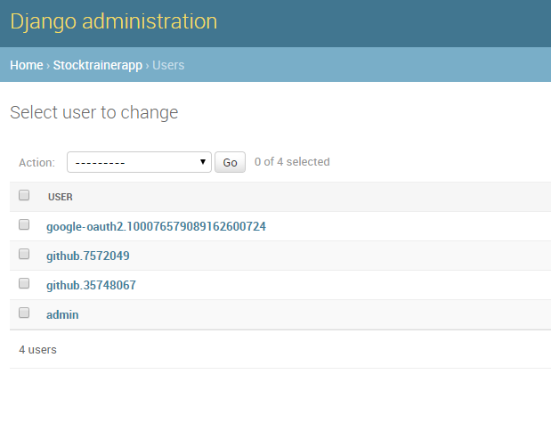
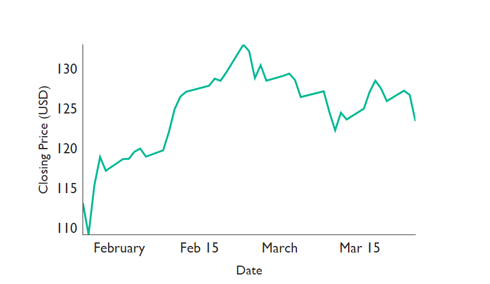
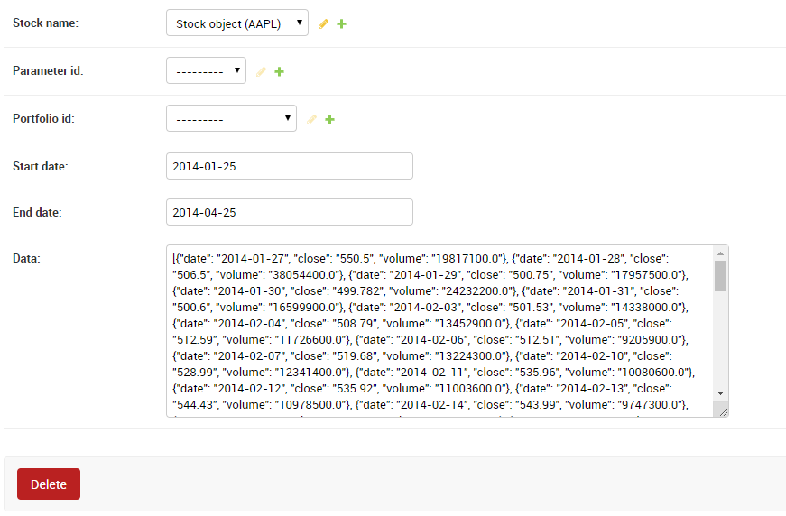

Third week of labs...

<!-- end -->

## Accomplishments

This week was pretty hectic as well. We lost two more group members, who were more experienced with Django, so I had to jump in and take care a lot of the backend code. First, I was finally able to get Auth0 working with our Django code, which will be talked more about below. After having a working user model, we were able to progress very quickly through our features. I was able to get stock data to save into our database, and write endpoints for adding favorites to the user. I was also able to get the graph data rendering on our front-end, which sets us up to be finished with MVP for this week. I do think that a lot of the Django code currently can be cleaned up, but that will be worried about once everything is working.

### Front End
- Graph for stock data
    - [Github](https://github.com/Lambda-School-Labs/labs9-stock-trainer/pull/73)
    - [Trello](https://trello.com/c/MiR9Ariw/116-graphs-render-stock-data))

### Back End
- Auth0 & Models
    - [Github](https://github.com/Lambda-School-Labs/labs9-stock-trainer/pull/60)
    - [Trello](https://trello.com/c/x8qbJg3p/79-connecting-auth0-front-and-back-end)
- Stripe Upgrades User
    - [Github](https://github.com/Lambda-School-Labs/labs9-stock-trainer/pull/63)
    - [Trello](https://trello.com/c/oPMSeOQb/92-stripe-flow-for-toggling-free-paid-user)
- Stock Data Save into DB
    - [Github](https://github.com/Lambda-School-Labs/labs9-stock-trainer/pull/65)
    - [Trello](https://trello.com/c/GMfXiSUi/102-get-data-in-db)
- Favorite Stock Endpoint
    - [Github](https://github.com/Lambda-School-Labs/labs9-stock-trainer/pull/67)
    - [Github](https://github.com/Lambda-School-Labs/labs9-stock-trainer/pull/69)
    - [Github](https://github.com/Lambda-School-Labs/labs9-stock-trainer/pull/71)
    - [Trello](https://trello.com/c/J9SRizkH/86-add-favorites-to-backend-link-to-user-account-and-write-an-endpoint)

### Misc
- Bug fixes
    - Current_user response
      - [Github](https://github.com/Lambda-School-Labs/labs9-stock-trainer/pull/61)
    - Fix stock route
      - [Github](https://github.com/Lambda-School-Labs/labs9-stock-trainer/pull/70)

## Detailed Analysis

#### Auth0 Troubles

For some reason, our Auth0 code for our backend was not working. I tried everything, and nothing was working. This was partially due to my inexperience with Django, and how the users are set up. In order for the Auth0 flow to work, there has to be a user in the DB that can be associated with the Auth0 token. We utilized the unique username that Auth0 provided, which was along the lines of `github.123456`. When I realized that we had two user tables, I realized that we were utilizing the wrong user table. This was due to messy models being written during the beginning of the back-end code base, just so we could model out our relationships. I looked into how to correctly inherit Django's auth user and incorporate that to extend the variables we would need. After condensing the users into one table, I was able to get Auth0 working, and modify our models to have clean relationships so that we could progress implementing our features. 

## Reflection

I think the most important part of working in a team is having good communication. I worked closely with my team members to make sure to understand what type of information they were expecting from either the front-end or back-end, and then communicate about how I envisioned the responses to be like as well. This allowed for quick progress despite losing half our team members, and allowed us to work efficiently. I realized the importance of documenting your code and how to interact with an API that you wrote. There is a user experience for everyone, and that includes interacting with a back-end. I think it's also an important skill to go read someone else's code and try to understand how information is flowing and what they set up for future contributers. This allowed me to quickly implement saving data to our database, as well as work on the graphing of the stock data more efficiently.

- [Front End](https://stock-trainer.netlify.com/)
- [Back End](https://backend-stock-trainer.herokuapp.com/api/)
