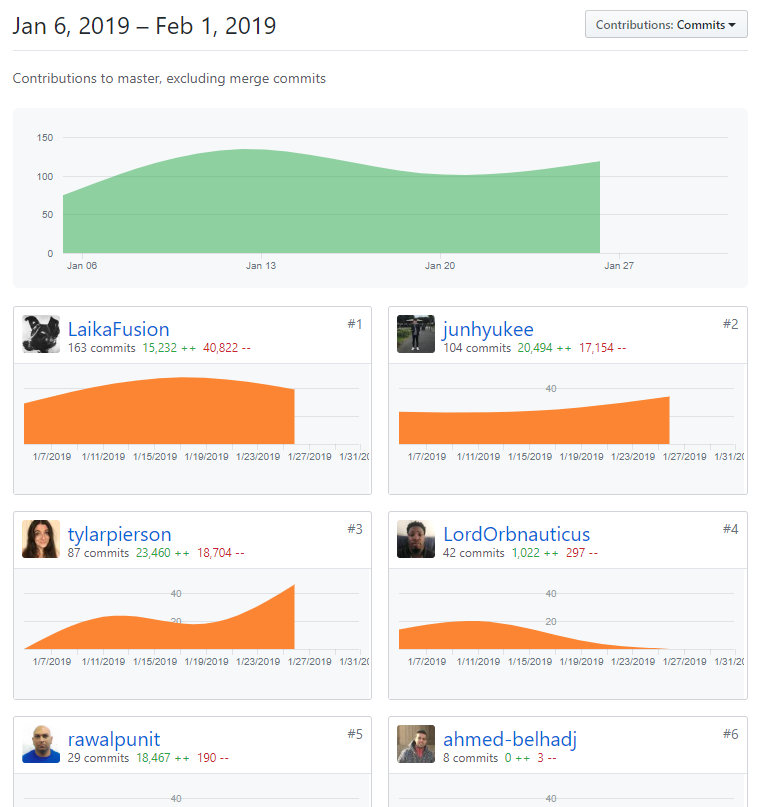
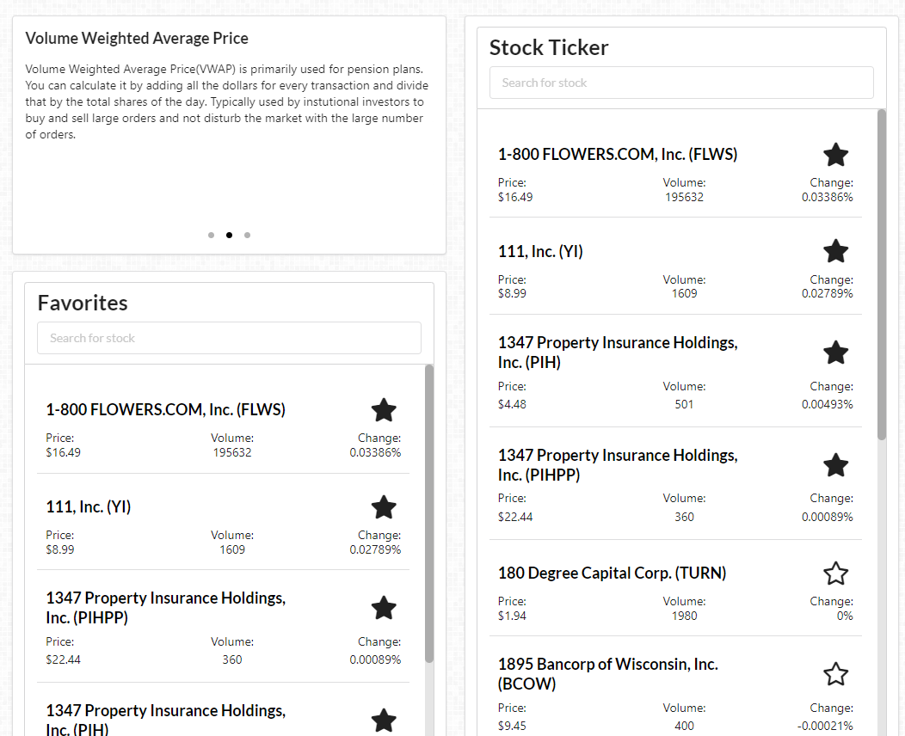
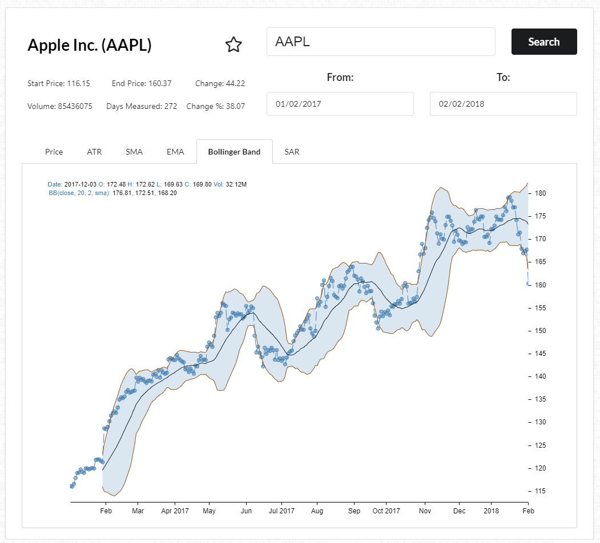
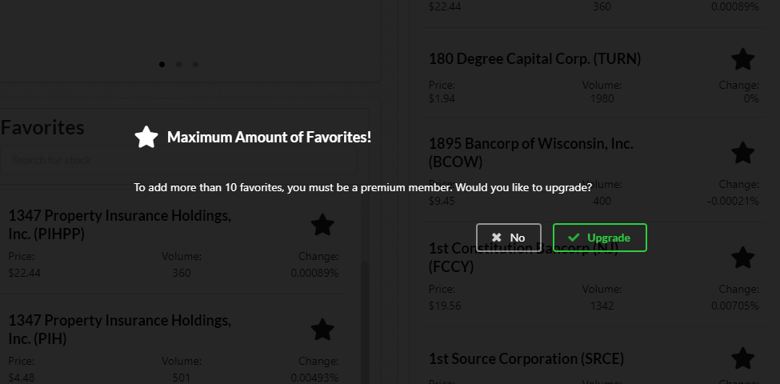

Fourth week of labs...

<!-- end -->

## Accomplishments

This week was overwhelming at first, because it seemed like we had a lot to accomplish and not enough time. However, as the week went on, we made a lot of good progress, thanks to good communication and good team members. Although we are only a team of 3, we work really quickly and efficiently, due to good work delegation and balancing tasks. This week, we were able to pretty much hit MVP, and there are a few modifications we could have here and there, but overall I am pretty happy with our progress. Some of the more major featuers I implemented this week was to get a stock ticker working, convert our graphing library to one that supported indicators, add a loading component for users, and adding an incentive for upgrading to premium status.

### Front End
- Start Stock Ticker
    - [Github](https://github.com/Lambda-School-Labs/labs9-stock-trainer/pull/78)
    - [Trello](https://trello.com/c/YpBjPiHt/58-live-ticker)
- Stock Ticker Refinements
    - [Github](https://github.com/Lambda-School-Labs/labs9-stock-trainer/pull/79)
    - [Trello](https://trello.com/c/YpBjPiHt/58-live-ticker)
- Graphs + Indicators
    - [Github](https://github.com/Lambda-School-Labs/labs9-stock-trainer/pull/86)
    - [Trello](https://trello.com/c/40vkczbM/123-different-charts-for-each-tab-on-the-reports-page)
- Loading Component
    - [Github](https://github.com/Lambda-School-Labs/labs9-stock-trainer/pull/93)
    - [Trello](https://trello.com/c/9YLvDHg8/99-add-loading-thing-when-request-is-made-of-the-backend)

### Back End
- Favorites Limiting
    - [Github](https://github.com/Lambda-School-Labs/labs9-stock-trainer/pull/87)
    - [Trello](https://trello.com/c/WJe0YOd7/125-limit-favorites-for-non-premium-users)

### Misc
- Add NYSE stock data
    - [Github](https://github.com/Lambda-School-Labs/labs9-stock-trainer/pull/82)
    - [Trello](https://trello.com/c/PsbvZQoO/78-working-stock-search)
- Documentation
    - [Github](https://github.com/Lambda-School-Labs/labs9-stock-trainer/pull/96)
    - [Trello](https://trello.com/c/ptlDctTH/12-readme)

## Detailed Analysis

#### Stock Ticker

The stock ticker was a tricky component, because we needed real time data for the current day, for a bunch of stocks. This meant that we needed an API that would support feeding us real time data, as well as supporting a bunch of requests without rate limiting us. There were many options initially, but really there was only one that would work, IEX. I was able to utilize their API endpoint to make one API call for the list of stocks in the columns. I'm also utilizing Object.assign(), which I don't know if it's better performance than just straight out overwriting the previous object. Overall, load times seem pretty reasonable, and our requests are throttled by IP, so as long as users are conservative with scrolling through the list and search queries, the API should work just fine for our use case.

## Reflection

Andrew took care of most of the polishing for CSS, as he was most familiar with the layouting and had been doing the most work in CSS. I tried to add a few of my own small modifications, such as making the indicator carousel dots smaller, trying to incorporate his width/height fix for the old victory graph for our new graph as well, and trying to fix up some of the bad wording we had for our stripe component on the front-end. Because we only have three members in our group and had a bunch of features to push out, my focus had to be on working on the features rather than trying to mess around with CSS that I wasn't all too experienced in compared to Andrew. I am happy with how the styling turned out, and it has been nice to have a super reliable team mate.

- [Front End](https://stock-trainer.netlify.com/)
- [Back End](https://backend-stock-trainer.herokuapp.com/api/)
