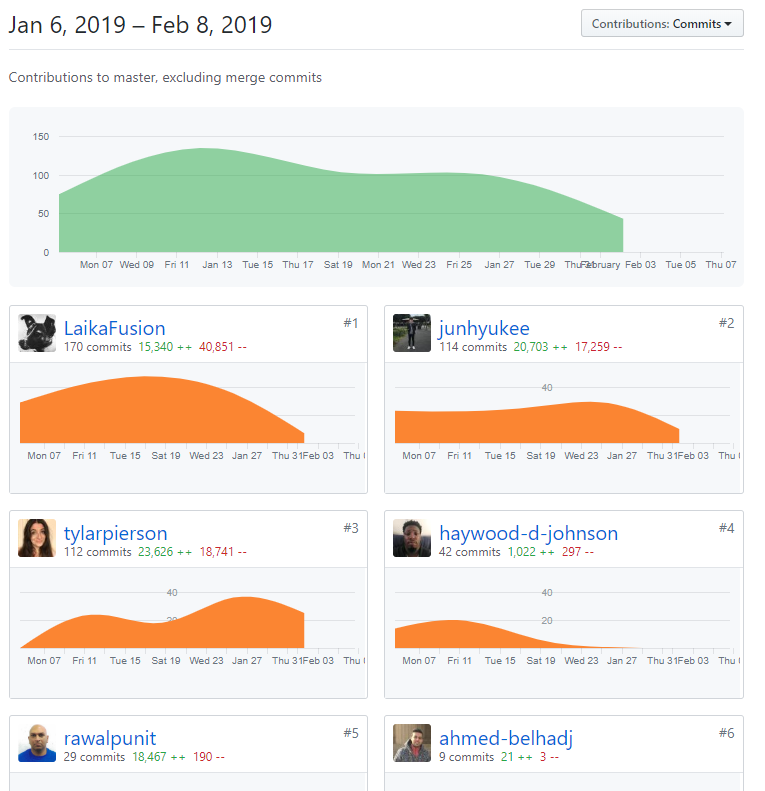
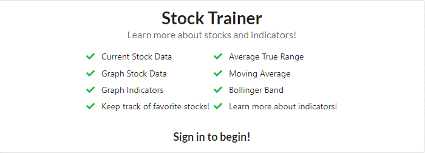

Last week of labs!

<!-- end -->

## Accomplishments

This week was focused on polishing the application, but we already focused on that last week. We didn't really have much to work on this week, and everyone wanted to focus on starting the job search and so our project didn't receive as much love as the previous weeks. I did a few bug fixes and worked on the documentation, and also did some css changes to some components that did not have any styling at all. I also made the video for our group.

### Front End
- Fix Stripe URL
    - [Github](https://github.com/Lambda-School-Labs/labs9-stock-trainer/pull/104)
- Touch Ups
    - [Github](https://github.com/Lambda-School-Labs/labs9-stock-trainer/pull/101)
    - [Trello](https://trello.com/c/xysMNFxz/20-design-a-front-end-landing-page)

### Misc
- Documentation
    - [Github](https://github.com/Lambda-School-Labs/labs9-stock-trainer/pull/97)
    - [Trello](https://trello.com/c/ptlDctTH/12-readme)

### Video
- [Youtube](https://www.youtube.com/watch?v=iXQ1gl4ClbI&feature=youtu.be)

## Detailed Analysis

#### Youtube

Back in high school, I used to play around with Sony Vegas a lot and work on my video editing skills. I don't have my Sony Vegas license from back then, so I looked for an open source video editor. I also found an open source screen recording software, as well as an audio recording software that I already had in my system. Due to my small experience with video editing and recording, I was able to quickly create a video and make it so that after Brian suggested some changes, I was able to quickly alter the original video to meet the changes.

## Reflection

#### Stack
We used React on the front-end and Django on the back-end. React was chosen due to the flexiblity of creating reusable components, and Django for the powerful features that Django provides (RESTful, ORM, etc). Stock Trainer is an application that was made so that users can learn more about stocks and how to trade. We didn't make a trading platform, but rather a more educational platform that users can use to get introduced to some of the more complicated topics.

- [License](https://github.com/Lambda-School-Labs/labs9-stock-trainer/blob/master/stockTrainerFrontend/src/pictureSources.txt)
- [Front End](https://stock-trainer.netlify.com/)
- [Back End](https://backend-stock-trainer.herokuapp.com/api/)
